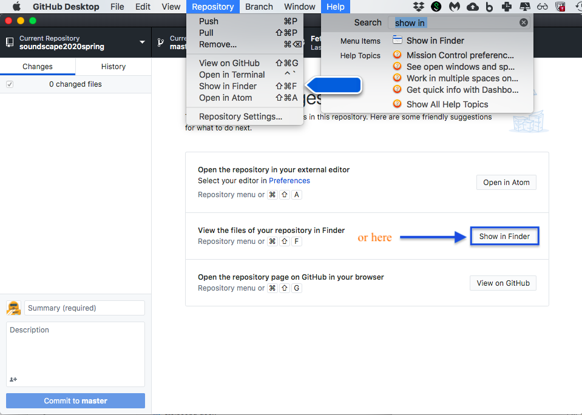

# Week 3: GitHub, versioning, circulation
September 9, 2024

<section class="prereqs">
    

<strong>Texts to have read / watched</strong>

        <ul>
            <li>Birnbaum, David J., and Alison Langmead. “Task-Driven Programming Pedagogy in the Digital Humanities.” <em>New Directions for Computing Education</em>, edited by Samuel B. Fee, Amanda M. Holland-Minkley, and Thomas E. Lombardi, Springer International Publishing, 2017, pp. 63–85. DOI.org (Crossref), <a href="https://doi.org/10.1007/978-3-319-54226-3_5">https://doi.org/10.1007/978-3-319-54226-3_5</a>.</li>
            <li>Stolley, Karl. “The Lo-Fi Manifesto, v 2.0.” <em>Kairos: A Journal of Rhetoric, Technology, and Pedagogy</em>, vol. 20, no. 2, Jan. 2016, <a href="https://kairos.technorhetoric.net/20.2/inventio/stolley/">https://kairos.technorhetoric.net/20.2/inventio/stolley/</a>.</li>
        </ul>
        <ul>
            <li>Posner, Miriam. “How Did They Make That? The Video!” Miriam Posner's Blog, April 17, 2014. <a href="https://miriamposner.com/blog/how-did-they-make-that-the-video/">https://miriamposner.com/blog/how-did-they-make-that-the-video/</a>.</li>
            <li>Posner, Miriam. How Did They Make That? 29 Aug. 2013, <a href="https://miriamposner.com/blog/how-did-they-make-that/">https://miriamposner.com/blog/how-did-they-make-that/</a>.</li>
            <li>Risam, Roopika, and Alex Gil. “Introduction: The Questions of Minimal Computing.” <em>Digital Humanities Quarterly</em>, vol. 16, no. 2, 2022, <a href="https://www.digitalhumanities.org/dhq/vol/16/2/000646/000646.html">https://www.digitalhumanities.org/dhq/vol/16/2/000646/000646.html</a></li>
        </ul>
    

    

<strong>Writing to turn in</strong>

        <ul>
            <li><a href="https://forms.gle/ydduVUJq4YAxp3XRA">survey</a> about your work environment, etc, including a letter to Ben in response to his, if you didn't during lesson 1</li>
            <li>an <a href="{{site.repo_url}}/discussions/1">intro post</a> to the discussion forum</li>
            <li>a <a href="{{site.repo_url}}/discussions/2">reader-response post</a>, also to the discussion forum, focusing our attention somewhere in the readings</li>
        </ul>
    

    

<strong>Software to set up</strong>

        <ul>
            <li>Install a <em>plain-text editor</em> if you don't already have one: <a href="https://pulsar-edit.dev">Pulsar</a> or <a href="https://code.visualstudio.com">Visual Studio Code</a></li>
            <li>Create an account at <a href="https://github.com">GitHub</a></li>
            <li>Install <a href="https://desktop.github.com">GitHub Desktop</a></li>
        </ul>
    

</section>

## Plan for the day:

* [First half](#first-half): Learning, Openness, Flexibility, Iteration (80 min)
    - Welcoming new people (5 min)
    - Discussion of readings, using your posts as jumping off points (~60 min)
    - Writing to Remember (~15 min)
* Break (10 min)
* [Second half](#second-half): Getting to know Git(Hub) (75 min)
    - Affordances
    - Repositories
    - Commits
    - Push & pull
    - Fork & clone
* HW for next time (~5 min)

## First half: Learning, Openness, Flexibility, Iteration {#first-half}

### Welcoming new people (5 min)

We have at least one new student and one new faculty member with us today who wasn't here last week!

While we don't have time to go all the way around the room with intro spiels, I do want to make everyone welcome and help you all get to know one another. So please:

1. let's take out (or re/make) our little nameplates, and
2. when it's your turn to make a comment, please also say your name and program before you start.

I will also briefly introduce our special guest, Dr. Alison Langmead! Alison wears many hats: she is faculty in both <abbr title="Dietrich School of Arts and Sciences">DSAS</abbr> and <abbr title="School of Computing and Information">SCI</abbr>, holding both a PhD and an MLIS; she directs the Visual Media Workshop; she's the graduate advisor for the <abbr title="Digital Studies and Methods">DSAM</abbr> certificate program, and has taught the DSAM Practicum, Seminar, and Capstone courses more than a few times. She also publishes, as you know, in digital humanities and digital culture and especially on mindful application of digital methods. Thank you so much for joining us!

### Starting points
Below are some passages to revisit and unpack. As we discuss, let's take notes at [bit.ly/dsam{{site.course.slugterm}}-notes](https://bit.ly/dsam{{site.course.slugterm}}-notes). (Any volunteers to lead the note-taking?)

Background exposure to digital tools

    
Scylla brought us this passage from the start of Birnbaum and Langmead's article:

    <blockquote>
        
Written argumentation is a complex tool that takes skill and practice to master, and we are not expected to master it quickly or all at once.

        
Our training in how to use this tool begins as soon as we learn to read and write, that is to say, in elementary school. Slowly but surely, throughout K-12 education, we learn the principles of writing grammatically correct sentences that can be put in a particular order so that they might best convey to others the ideas that we have in our heads. Before students reach college, they will have been exposed to—if not mastered—the principles of effective analytic writing. They will then be expected to practice this tool throughout college in different subject areas. Indeed, students will take their ability to produce essays from their Japanese history classes to their Russian fairy tales classes to their Renaissance art history classes, applying this tool to each successive domain and using it to demonstrate and communicate what they have learned of the subject.

    </blockquote>
    
This raises some questions. In Scylla's words: "What is the backdrop of digital tools that we've all been exposed to throughout our lived experiences and our schooling? How does that shape what tools we reach for when planning a digital humanities (DH) project? What can be learned about those contrasting experiences?"

    
John's post included some of the many programming languages he's worked in, most quite some time ago, I think; but beyond those, I just wonder about the tools we reach for when we have a question. How many turn to Google first? Wikipedia? Library database? ChatGPT? What was your go-to growing up? How has it changed?

Not a requirement but a useful tool

    
Rose, Namrata, Tunga, and Li all raised questions about how lines have been drawn (or walls have been built?) between <em>the humanities</em> and <em>the digital</em>.

    
On the one hand, "newcomers to Digital Humanities [...] will have much to learn that might seem entirely alien and alienating" (Birnbaum and Langmead 66); on the other hand, "what is new is often much more the digital context than the actual research practice" (ibid), such that more of our prior knowledge and skillsets might be applicable than it seems at first. To the extent that "integrating digital tools into humanities training is not yet widespread practice, [...] this might result from a misconception that digital tools are something foreign that we import from outside the humanities" (64).

    
Namrata asked, "how would I make the decision to use digital humanities to answer my research questions as opposed to using the methods I'm trained in? [...] How do I prevent myself from employing digital methods <em>for the sake of</em> using digital methods?"

    
I think Rose's post begins to speak to that, drawing on Birnbaum and Langmead to argue that "digital methods are not a <em>requirement</em>, but a <em>useful tool</em> to have in the event it would benefit the research process in a particular project." Rose, do you want to say more? Namrata? Alison?

The seduction of seamlessness

    
Yanni was braced by Stolley's healthy dose of skepticism toward "the highest-fi functionality that proposes to be a marker of upper-echelon digital products." He noted, too, the "ubiquity" of products designed for work and how they often become "the same things we use when we're ostensibly not working," concluding that "the seamless-ness of it all is a bit chilling to me." Those were Yanni's words; here are Stolley's:

    <blockquote>When writers write and revise by hand to make digital things, they introduce a missing human element and human timescale into the process and the production. [...] Yet far too many [people working in rhetoric, writing, and the humanities], and their students, surrender writing and its demand for sophisticated production knowledge to any interface that promises to make an author's life easier. [...To the contrary, t]he richest learning experiences reveal how failure and crude initial work transform to something better only through ongoing research and revision.</blockquote>
    
Tunga, likewise, draws on Risam and Gil to focus on "grit and creativity [as] the driving force behind making digital projects work": success doesn't come from raw computational power, or tools that promise to make life easy for you, but rather (in Risam and Gil's words) "shifting the frame of our thinking" toward "identifying the resources we have at our disposal" (paragraph 7), and "making do with what you have however you can."

    
But there's a tension here, right? In proposing to use minimal, lofi tools – which would work well in the many constrained environments Risam and Gil discuss –  Stolley is also challenging us to engage in difficult learning of new approaches: to forgo the Microsoft Word we know and try a plain-text editor for the same purposes. How do you think about the balance between these two kinds of minimalism?

<!-- /ease and expertise -->

<!-- 

Free as in...

    
Stolley writes:<blockquote>Lo-fi production technologies are stable and free: sometimes free as in beer; sometimes free as in speech; and sometimes, if not chosen only after careful research, <a href="http://www.linux-mag.com/id/1678/" title="I know it's broken. It wasn't originally. You can use a bookmarklet to find it on the Internet Archive!">free as in puppy</a>.</blockquote>

    <ul><li>Can we unpack these metaphors, especially for those who haven't encountered them before?</li><li>What's the role of research and stability here?</li></ul>

 <!-- /free as in... -->

<!-- 

To database or not to database

    
Stolley writes:<blockquote>
Ask someone why they chose a particular technology for a project, and you will often find one little feature driving the decision. It’s astounding, for example, to discover that people choose to set up WordPress to run a small website simply because they wanted a way to repeat the navigation across the four or five pages that made up the site. For that one feature, they pay the tax of securing a database connection and applying software updates for the life of the project [...]

A database might be lo-fi on its surface, but <strong>a database is best employed only under one of two conditions, usually both</strong>: first, there must be far more records than can be reasonably handled by flat files (that is, a database record per page of a website, rather than an HTML file per page). Second, database-like things must routinely be done to those records: sorting, counting, joining, and so on, in the context of more read–write operations than can be handled by flat files. <strong>A five-page website that’s infrequently updated does not fit that bill.</strong> (emphasis added)
</blockquote>

    
This feels important to flag as you start to imagine what your <a href="../projects#palimpsest-of-public-iteration">public-facing project deliverables</a> will look like, through the several iterations you'll build this term. Some of you are, indeed, planning to do database-like things! But if you only have a handful of objects or arguments, rather than a big spreadsheet's worth of data, maybe standard HTML is enough – and well worth learning in the context of a class like DSAM.

    
(Even if you haven't done it before, I bet I can get you up and running in about 2-3 weeks with tutorials like <a href="https://learn.kevinpowell.co/course/html-css-for-absolute-beginners">HTML & CSS for absolute beginners</a> and <a href="https://flukeout.github.io/">CSS Diner</a>. And after all, to quote Stolley again, "to learn any one markup language is to learn <em>about</em> the general idea of markup languages," making it easier to learn others later on.)

 <!-- /to database or not -->

### What else?

I'm open to other ideas, questions, and curiosities!

Let's just save at least 15 minutes to write and share notes, starting at around 10:10 or 10:15.

### Writing to remember

    
Spend some time putting marks on a page to help you think through, and consolidate for yourself, what we discussed today. What do you want to remember? What are you left wondering?

After a few minutes, I'll ask everyone to share one thing, to which the only response will be "thank you."

## Break (10 min)
Assuming we left off at 10:25, let's aim to start up again at 10:35. That should beat the elevator rush for 11am classes while still giving us a good hour to discuss the readings.

## Second half: Getting to know Git(Hub) {#second-half}

In his [manifesto](https://kairos.technorhetoric.net/20.2/inventio/stolley/#manifesto), Karl Stolley elevates Version Control to a key principle for digital production: "Always. Everywhere. For everything."

> Next to the plain-text editor, there is no more important piece of software in a lo-fi stack than a version control system. It is the piece that makes experimentation possible, reduces the friction of collaboration across time, space, and platforms, and makes learning and the sorely lacking component of revision a central part of digital production.

So far so good! But I suspect this whole section might be a little COIK: clear only if known.
<!-- Quick show of hands: who's used git or github before? -->

So today I want to make sure you all get at least a taste of what git can do.

<!-- <aside class="alert alert-info">Side note: <em>exigence</em>, i.e. why we're talking about what we're talking about, is one element of the <a href="https://en.wikipedia.org/wiki/File:Rhetorical_situation_triangle.jpeg">rhetorical situation</a>: a way of theorizing what writers and speakers consider in deciding what to say or write.</aside> -->

### GitHub Desktop: a <dfn title="graphic user interface">GUI</dfn> <dfn title="version control system">VCS</dfn>

I'd asked you all to install this app, which should automatically also download its <dfn>dependencies</dfn>, i.e. the other programs required for it to work.

I'm going to do a little demo, and I'd like you to follow along. (If you had to miss class, or you want to go over it again, there's a [walkthrough on docs.github.com](https://docs.github.com/en/desktop/overview/creating-your-first-repository-using-github-desktop) that covers some of the same ground.)

#### 1. First impressions

First, let's open the app.

If you get an error message that it's "not trusted", don't worry: it is. It's just not in your app store. Right-click and select Open > Open Anyway to get around the barrier.

    
Initial questions to ask of any interface:
        <ul>
            <li>How is the space laid out?</li>
            <li>What's given the most prominent visual focus? Secondary focus?</li>
            <li>What features/tools do you have quick access to?</li>
        </ul>
    

    
In other words: what functions or actions are <dfn>afforded</dfn> by this interface? What does it seem to expect you to be looking for? What does it seem to expect you to <em>do</em>?

#### 2. Initiate a new repository

<!-- 

    

Do you know where to do that? How can you figure it out? (Think back to those questions from above: what does the interface give you quick access to?)
 

 -->

Show me

    If you don't see a button, you can use the menu: File > New (or the shortcut you see there) should work.

A <dfn>repository</dfn>, often abbreviated to _<abbr>repo</abbr>_, is just a fancy way of saying a _folder_. It's a bunch of files. It can have subfolders inside it. By calling it a repo, we're saying it's a folder we want to pay attention to: a folder we want to track.

To confirm that, let's look at the repo we just created from another vantage point: in Explorer (for Windows users) or, equivalently, in Finder (for Mac users). Conveniently, GH Desktop gives us a shortcut.

<figure>
    
    <figcaption>If the button isn't visible, you should still be able to find it in a menu.</figcaption>
</figure>

#### 3. In the text editor
And now let's take another view: let's open it in a <em>text editor</em>. This is another of those digital tools Stolley was extolling. There are lots of good ones: I recommended either <a href="https://pulsar-edit.dev">Pulsar</a> or <a href="https://code.visualstudio.com">Visual Studio Code</a> (VSCode for short). They'll have slight differences, but both are full-featured, extensible tools for all kinds of text manipulation, from basic note-taking to programming.

First, notice: we can see the same files as before.

But also, now, we can edit them. Let's do it! Please follow along with your own content.

* Open the README
    - Make a change
    - Save it

    

    Did you notice how the editor signals that the file has unsaved changes? If not, make another change (or undo your previous one) and look carefully.

* Create a new file

    

Do you know where to do that? How can you figure it out? (Think back to those questions from above: what does the interface give you quick access to?)

* In the new file, **write a version of the question you want to pursue for your DSAM project this term.** It doesn't need to be long.
    - If you've already met with me, you might already have this ready to go!
    - If not, don't worry: take a minute now to think about it. Whatever you come up with is a worthwhile draft.

* When you've reached a stopping point, save the file.
    - NB: this means you need to give it a name! And also (usually) a <dfn>file extension</dfn>: that short ending like `.md` or `.txt` or `.html` that will tell the computer how to interpret this text.

We've already seen `.md` on the README file: it signals that the file is formatted in <dfn>Markdown</dfn>, the shorthand markup language you used in your discussion board posts. It's often a good way to go to build in structure and formatting.

The plain text file (`.txt`) doesn't use formatting or encode any stylistic transformations: what you see is what you get. If you add no extension to the filename, generally speaking the computer will treat it as plain text.

#### 4. Back to GH Desktop

What's changed? What's given prominent attentional weight now? What is the app encouraging you to think about, or do?

In other words, what new affordances are present now that weren't here before?

What git does – and how we can help it help us

    
Git pays attention to <em>changes in files</em> saved within the repo. You can make any changes you'd like, and when you've reached a stopping point, you can <strong><dfn>commit</dfn></strong> those changes to the repo's history: it's kind of like an especially saved save. Once you've made a commit, you can later travel back to that moment from the project's past. If the file types are simple enough (text or image), you can even see the before-and-after, which git calls <dfn>diffs</dfn>.

    
Each commit has a machine-meaningful <dfn>hash</dfn> associated with it – a long string of letters and numbers, derived from the contents of the files – numerical representation, remember? – so each commit hash is essentially unique. But these hashes not very meaningful to humans! So every time you commit, you're prompted to also write a short <dfn>commit message</dfn> summarizing what's changed in that commit – or, perhaps, a reminder of what you want to do next.

    
It's a good practice to <strong>make your commit messages meaningful</strong>: "draft 12" isn't much more informative than "h6287c", though I suppose both are better than the default: "file changed." We can improve on that, I hope!

Once we've discussed what it means and why, go ahead and **write a commit message for the changes you've made so far.** The top line is like the subject line of an email; it has a character limit. The bottom box is like the contents, and can be as long as you want.

Then **click commit**.

* What happens to your files?
* What happens to your commit message?

#### 5. Solo vs. social

Working on your own, it's enough that you commit. Working with others involves little more push and pull.

To <dfn>push</dfn> your changes means to upload them to the cloud, in a place where others can find them. (NB: you can only do this if you first publish your repository - which you may have noticed GH Desktop encouraging you to do. I'll leave it up to you to decide if the repo you just made is one you want to publish.)

To <dfn>pull</dfn>, naturally, is the opposite: to take changes that exist online and sync them to your local machine.

In both cases, what's moving are the _committed changes_, because it's not just the file's current state that's being updated: it's the full _history_ of the entire repository. For that reason, push and pull require that the local and remote repositories are linked: in git-speak, they are _clones_ of each other.  

You can only push to, and pull from, a repo that you control. But one of the main reasons to publish your repo is to collaborate – or, at least, to borrow and adapt someone else's files to your own needs, even if you're not contributing back to the public source. So GitHub gives us options to get in on the action.

**Have a look at [https://github.com/benmiller314/Electrate-Fuego](https://github.com/benmiller314/Electrate-Fuego).** This is a copy of my colleague Stephen Quigley's DH project for helping people learn HTML and CSS by poking around and modifying the code of an existing website.

Given a public repo, we can...

- <dfn>fork</dfn> it, creating a linked copy we control (That's what I did here. Do you see where the links point back to the original?)
- <dfn>clone</dfn> it, downloading the full contents and all the file history
- or just _download_ the contents as a `.zip` archive. This strips out the history, but means we could also start over clean in an unlinked repo if we want.

Have a look around. Anything else you notice about GitHub's web interface vs. the GH Desktop app interface?

EXT: Make your own copy of the project – fork, clone, or download – and begin reading and editing the `index.html` file with your text editor. If you did the simple download but want to track your changes, you can use GH Desktop to Create New Repository in the unzipped folder. (Or you could use command line git...)

## For week 4 {#hw}

### Should we divide response post responsibility?

    

        Reflecting on the reading responses and the size of the class, I'd like to propose a change to the reading response assignment – if you agree. I think we might ask <em>just half the class</em> to post online each week. The other half would lead discussion when we get back. And we'd switch back and forth for each set of readings.

For example, this week, Tunga, Rose, John, Scylla, and Li had all posted by Friday before class. So we could say they're "Group 1." That would leave Yanni, Namrata, Amrita, Yixuan, and Yuqing as "Group 2."

We could even have people sign up to take the lead on a particular text, so you're more likely to have thoughts - and less likely to have decision paralysis about where to start - by Friday.

You're always welcome to post whenever you want to! I was just thinking in terms of clearing our minimum bar.

What do you think?

### Shared readings

Birnbaum and Langmead write:
> Our argument is not that every humanist needs to learn to code, but that humanities scholars whose research would benefit from the use of digital methods ought to be given access to more focused, domain-specific opportunities to acquire the knowledge and skills needed to conduct that research. And if the research agenda cannot be seen to completion entirely with existing software tools, humanities scholars should be encouraged to build their own. (75)

With that in mind, next week's readings consider the means by which new software tools are built: computer code. NB: Without EXTs, this adds up to 96 page-equivalents; adding *all* the EXTs would roughly double it, to 181. There are also intermediate options.

By Friday, please **read**:

* Ford, Paul. <em>What Is Code? If You Don’t Know, You Need to Read This</em>, Bloomberg.com, <a href="http://www.bloomberg.com/graphics/2015-paul-ford-what-is-code/">http://www.bloomberg.com/graphics/2015-paul-ford-what-is-code/</a>.
    - Section 1, starting with "The Man in the Taupe Blazer," ending (ironically enough) at Section 2: "Let's Begin."
    - Don't miss the video. :)
    - EXT: If you have just a few extra minutes, I highly recommend section 2.3: "How Does Code Become Software?" and 2.4: "What Is an Algorithm?"
* Vee, Annette. “Introduction: Computer Programming as Literacy.” <em>Coding Literacy</em>, MIT Press, 2017, pp. 1–42, <a href="https://doi.org/10.7551/mitpress/10655.003.0003">https://doi.org/10.7551/mitpress/10655.003.0003</a>.  <a href="https://direct-mit-edu.pitt.idm.oclc.org/books/monograph/3543/Coding-LiteracyHow-Computer-Programming-Is">(Pitt library link)</a>.
* Bertram, Lillian-Yvonne, <a href="https://www.lillianyvonnebertram.com/">https://www.lillianyvonnebertram.com/</a>. Read around in Projects, especially "Forever Gwen Brooks," "Syncopated Star," and "I dream of creating an intelligent machine".
    - Look up how to "View Page Source" using your preferred browser. Then view page source on each of these projects.
* Whalen, Zach. “Any Means Necessary to Refuse Erasure by Algorithm: Lillian-Yvonne Bertram’s Travesty Generator.” <em>Digital Humanities Quarterly</em>, vol. 017, no. 2, July 2023, <a href="https://digitalhumanities.org:8081/dhq/vol/17/2/000707/000707.html">https://digitalhumanities.org:8081/dhq/vol/17/2/000707/000707.html</a>.
* Montfort, Nick, Patsy Baudoin, John Bell, Ian Bogost, Jeremy Douglass, Mark C Marino, Michael Mateas, Casey Reas, Mark Sample, and Noah Vawter. “10: Introduction.” _10 PRINT CHR$(205.5+RND(1)); : GOTO 10_, The MIT Press, 2012, pp. 1–17. direct.mit.edu, <a href="https://doi.org/10.7551/mitpress/9040.001.0001">https://doi.org/10.7551/mitpress/9040.001.0001</a>.
* Montfort, Nick. "Appendix A: Why Program?" <em>Exploratory Programming for the Arts and Humanities</em>, 2nd ed., The MIT Press, 2021, pp. 319–330, <a href="https://mitpress.ublish.com/ebook/epah2e-preview/12629/319">https://mitpress.ublish.com/ebook/epah2e-preview/12629/319</a>.

* EXT for eager readers:
    - The rest of Ford's <em>What is Code?</em> – but be warned, it's less like a magazine article than it is like the full magazine, or short book. It's great! Just... don't expect to be done after 20 minutes. Or an hour.
    - Miller, Benjamin. “Chapter 17: The Pleasurable Difficulty of Programming.” <em>Methods and Methodologies for Research in Digital Writing and Rhetoric: Centering Positionality in Computers and Writing Scholarship</em>, Volume 2, edited by Victor Del Hierro and Crystal VanKooten, The WAC Clearinghouse; University Press of Colorado, 2022, pp. 159–83. <a href="https://doi.org/10.37514/PRA-B.2022.1664.2.17">https://doi.org/10.37514/PRA-B.2022.1664.2.17</a>. (<a href="https://wac.colostate.edu/docs/books/positionality/chapter17.pdf">Direct link to chapter PDF</a>.)
