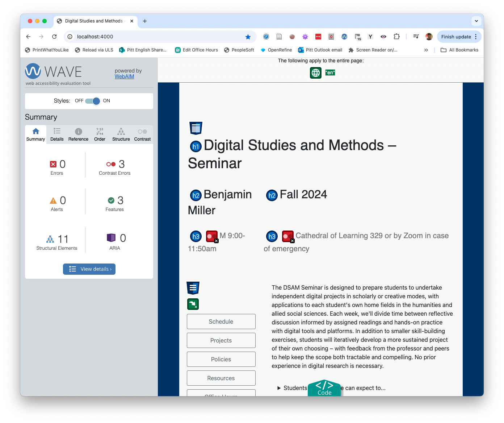
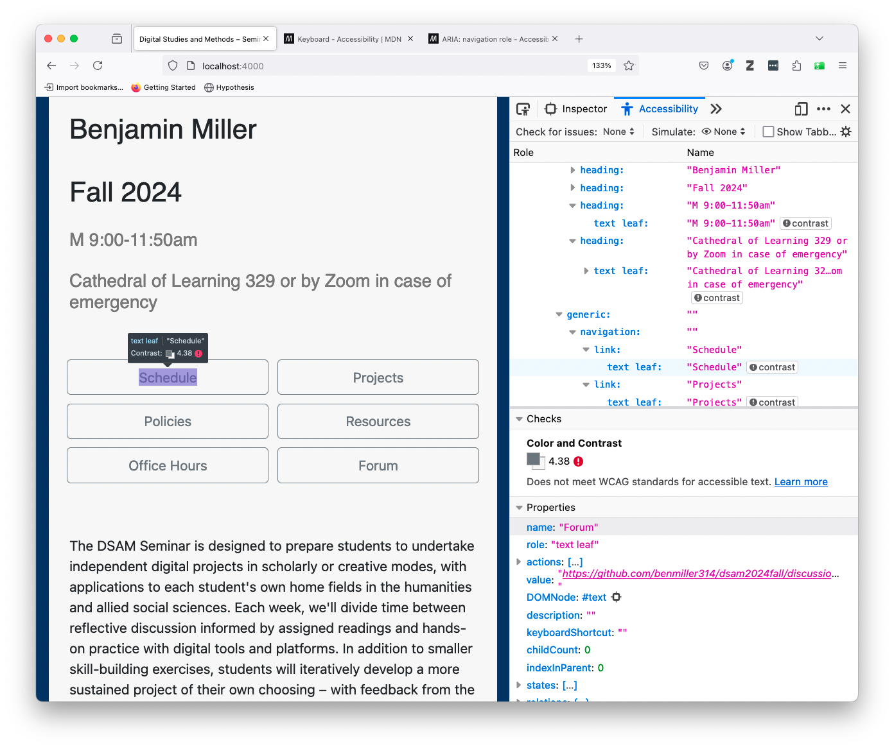

# Week 10: Digital Accessibility
October 28, 2024

<section class="prereqs">
    

<strong>Texts to have read / watched</strong>

        <ul>
            <li>Eisenberg, David. “Digital Accessibility: What It Is and Why It Matters.” Perkins School for the Blind, 17 May 2021, <a href="https://www.perkins.org/digital-accessibility-makes-the-world-a-better-place/">https://www.perkins.org/digital-accessibility-makes-the-world-a-better-place/</a>.</li>
            <li>Selections from the W3C Web Accessibility Initiative (WAI):<ul>
                <li><a href="https://www.w3.org/WAI/fundamentals/accessibility-principles/">"Accessibility Principles"</a> (Overview)<ul>
                    <li><a href="https://www.w3.org/WAI/people-use-web/tools-techniques/perception/">Perception - hearing, feeling and seeing</a></li>
                    <li><a href="https://www.w3.org/WAI/people-use-web/tools-techniques/presentation/">Presentation - distinguishing and understanding</a></li>
                    <li><a href="https://www.w3.org/WAI/people-use-web/tools-techniques/input/">Input - typing, writing, and clicking</a></li>
                    <li><a href="https://www.w3.org/WAI/people-use-web/tools-techniques/navigation/">Interaction - navigating and finding</a></li>
                </ul></li>
                <li><a href="https://www.youtube.com/watch?v=3f31oufqFSM">"Web Accessibility Perspectives - Compilation of 10 Topics/Videos"</a></li>
                <li><a href="https://www.w3.org/WAI/people-use-web/tools-techniques/">How People with Disabilities Use the Web: Tools and Techniques</a></li>
            </ul></li>
            <li>Yergeau, M. Remi, Elizabeth Brewer, Stephanie L. Kerschbaum, Sushil Oswal, Margaret Price, Michael J. Salvo, Cynthia L. Selfe, and Franny Howes. “Multimodality in Motion: Disability and Kairotic Spaces.” <em>Kairos: A Journal of Rhetoric, Technology, and Pedagogy</em>, vol. 18, no. 1, Aug. 2013, <a href="https://kairos.technorhetoric.net/18.1/coverweb/yergeau-et-al/index.html">https://kairos.technorhetoric.net/18.1/coverweb/yergeau-et-al/index.html</a>.</li>
        </ul>
    

    

<strong>Writing to turn in</strong>

        <ul><li>two peer reviews, posted to the <a href="{{site.repo_url}}/discussions/7">discussion forum</a></li></ul>
    

</section>

## Plan for the day:

* [First half](#first-half): Let's discuss!
    - Warm-up writing: tensions, takeaways, confusions, questions
    - Discussion: Questions, comments, connections
    - Grok writing (around 10:20)
    - Sharing (around 10:30)
* Break (10 minutes)
* [Second half](#second-half): Let's practice!
    - Inspecting accessibility
    - Headings and document outlines
    - Writing alt text
    <!-- - non-mouse navigation: keyboard, screen readers -->
    - EXT: Studio. <!-- Assess (and improve) the accessibility of your own public-facing project presentation. Except that _no one_ has a website yet, so...  -->
* [Homework for next time](#hw): Exploring (and cleaning?) data

## First half: Discussion {#first-half}

### Warm-up writing: tensions, takeaways, confusions, questions
I'd like you to start by calling to mind the readings for this week. What stands out to you as a particularly important **take-away**, something memorable or surprising? What stands out as an **unresolved** point of tension or confusion?

Depending on your own practices, you may want to make lists or freewrite, or even draw a picture or diagram. Either way, I want to spend 5 minutes on this composing-to-center. I won't collect it, but I will ask for volunteers to share.

### Discussion: Questions, comments, connections

If we get to grok-writing by around 10:15, that should give us about equal time to play with the concepts now and to play with the methods in the second half.

Let's take notes at [bit.ly/dsam{{site.course.slugterm}}-notes](https://bit.ly/dsam{{site.course.slugterm}}-notes).

**Who would like to share?**

    
Starting points, should we need them

    <ul class="spaced">
        <li><em>Perceivable, operable, understandable, robust</em>. How are these terms defined in relation to accessibility? How do they relate to digital studies concepts from earlier in the semester, including the <a href="week-01#digital" title="procedural, participatory, encyclopedic, spatial; or (alternatively) numerical representation, modularity, automation, variability, transcoding">affordances of digital media</a> that we discussed way back in lesson 1?</li>
        <li>Given what you know about GenAI, would you want to automate the creation of alt text? What could be the benefits? What could go wrong? How about video transcripts: is the risk/reward calculation the same?</li>
        <!-- <li>What does it mean to say that "Universal design is a process, a means rather than an end" (Yergeau et al, access.html)?</li> -->
        <li>How do Yergeau, Brewer, Kerschbaum, Oswal, Salvo, Selfe, and Howes take advantage of the digital medium to do things that wouldn't be possible on paper or in person? In what ways do they follow their own advice to make their webtext accessible and hospitable?</li>
        <li>Yergeau et al write, <blockquote>[T]o say that no text will be universally accessible is not a justification for failing to consider what audiences are invited into and imagined as part of a text. It matters who reads, in matters who engages, and it matters who is conceptualized as a reader. (access.html)</blockquote> Consider the "public-facing deliverable" for your own project. Who is "conceptualized as a reader" by your design choices? In what ways are you enabling or disabling access to your project? <!--Is there anything you might want to change by next time?--></li>
    </ul>

EXT: The fairness conundrum of presentations 3 & 4.

### Grok writing

    Spend some time putting marks on a page to help you think through, and consolidate for yourself, what we discussed today. What do you want to remember? What are you left wondering?

After a few minutes, I'll ask everyone to share one thing, to which the only response will be "thank you."

## Break (10 minutes)
I'm guessing we'll hit the break at around 10:40 or so. Try to be back for a 10:50 start, so we have a full hour to get hands-on.

## Second half: Let's practice! {#second-half}

### Inspecting a website's accessibility

There are lots of ways.

<ol>
    <li>We might try the <a href="https://wave.webaim.org/">WAVE browser extension/plugin</a>.
        <figure>
            
            <figcaption>The WAVE extension will quickly summarize both inhospitable features (errors, alerts) and hospitable features (features, structural elements) of the current web page, and labels them with icons. Further tabs provide details and reference materials you can use to improve.</figcaption>
        </figure>
    </li>

    <li>Firefox also has a pretty great built-in Accessibility Inspector. Just right-click anywhere on the page and choose "Inspect Accessibility Properties."
        <figure>
            
            <figcaption>Available by default in Firefox, the Accessibility tab of the Inspector tool can check for contrast, keyboard navigation, and text labeling issues. It can also simulate various kinds of color-blindness.</figcaption>
        </figure>
    </li>
</ol>

Any browser inspector will also let you experiment with changes to fonts, colors, and layouts – just remember to save your changes outside of the browser, or you'll lose them if you refresh the page.

(The color picker in Chrome's inspector is particularly good. Chrome's accessibility checker, not so much: it's all but non-existent.)

### Headings and document outlines

Both the inspectors above will also show the document outline implied by your headings and other HTML structural elements.

Even if you don't know much HTML, it's good to know about headings, because they're also present in other places like Word documents, Google docs, and Markdown files (such as a GitHub README).

In general, you shouldn't choose a heading level based on what it looks like – you can always change what it looks like to suit your preferences. Instead, use a logical nested sequence:

* Use a single `<h1>` (or `#` in Markdown) at the top of the page: this is more or less your title
* Use `<h2>` (or `##`) for the main sections of the page: the first column of the outline, essentially. Don't skip straight to `<h3>` or below.
* You can, however, jump back *up* to an `<h2>` if you've gotten down past `<h3>` to `<h4>`
* In general, differences in heading levels past the fourth are too hard to discern or keep track of, and you should probably look to restructure or just use a list or boldface (or both) to structure whatever's going on at that level of detail.

Let's have a look at our notes document: are the headings properly structured? How about the README for your project (if you have one)?

### Writing alt text

In retrospect, I should have assigned the WebAIM guide to Alternative Text at [webaim.org/techniques/alttext/](https://webaim.org/techniques/alttext/). As it stands, let's read through the beginning together, then split into pairs to discuss each of the examples.

When you get to a multiple choice option for how to label an image, <strong>talk through the options with your partner</strong>. Do you agree on what you would choose?

Once you've both voiced your best guess, read how the WebAIM team would label the image. Any surprises?

I'm hoping everyone will have time to get through at least the first four examples. If you can go further, go ahead while time allows.

EXT: If you finish the whole page, take some screenshots of your project and practice writing alt text for them. You can use these later on, in your final reflection.

### EXT: Studio

Finished with all the above? **Use the remaining time to work on your project** – or to produce transcripts of your video/audio files from last week. (Check the [resources page](../resources#transcription-services) for my current favorite AI transcription tool – or suggest others!)

## Homework for next time {#hw}

As always, continue working on your project – now with a little more feedback – and take notes in your [Mindful Practice Journal](projects.md).

I'll also ask you to **[add your thoughts to the discussion forum]({{site.repo_url}}/discussions) after reading**.

In preparation for <a title="required reading: 48 page-equivalents; EXT reading adds 31 (plus a book) for a total of 78 (plus a book)">week 11, on exploring data</a>, please:

* **Download** [OpenRefine](https://openrefine.org/), a "powerful[,] free, open source tool for working with messy data: cleaning it; transforming it from one format into another; and extending it with web services and external data."
* In addition, **watch / read**:
    - Gradek, Bob, and Liz Monk. "Dataset Summaries: Pivot Tables." vimeo, 2022. [https://vimeo.com/703773939](https://vimeo.com/703773939).
    - van Hooland, Seth, Ruben Verborgh, and Max De Wilde. “Cleaning Data with OpenRefine.” _Programming Historian_, Aug. 2013. [https://programminghistorian.org/en/lessons/cleaning-data-with-openrefine](https://programminghistorian.org/en/lessons/cleaning-data-with-openrefine).
    - Cairo, Alberto. “6: Exploring Data with Simple Charts.” The Truthful Art: Data, Charts, and Maps for Communication, New Riders, 2016. learning.oreilly.com, [https://learning.oreilly.com/library/view/the-truthful-art/9780133440492/ch06.html](https://learning.oreilly.com/library/view/the-truthful-art/9780133440492/ch06.html).
        * NB: to view the content, click "SIGN IN" at the top of the page, and begin logging in with your Pitt email address; you should then get the option to "Sign in with SSO" (single sign-on), which will take you to the Pitt Passport screen.
    - D’Ignazio, Catherine, and Lauren F. Klein. “5: Unicorns, Janitors, Ninjas, Wizards, and Rock Stars.” _Data Feminism_, MIT Press, 2020, pp. 125–48. [https://ebookcentral.proquest.com/lib/pitt-ebooks/reader.action?docID=6120950&ppg=138](https://ebookcentral.proquest.com/lib/pitt-ebooks/reader.action?docID=6120950&ppg=138).

* EXT for eager readers:
    - Arnold, Taylor, and Lauren Tilton. “New Data? The Role of Statistics in DH.” _Debates in the Digital Humanities 2019_, Univ of Minnesota Press, 2019, [https://dhdebates.gc.cuny.edu/read/untitled-f2acf72c-a469-49d8-be35-67f9ac1e3a60/section/a2a6a192-f04a-4082-afaa-97c76a75b21c#ch24](https://dhdebates.gc.cuny.edu/read/untitled-f2acf72c-a469-49d8-be35-67f9ac1e3a60/section/a2a6a192-f04a-4082-afaa-97c76a75b21c#ch24).
    - Crump, Jon. “Generating an Ordered Data Set from an OCR Text File.” _Programming Historian_, Nov. 2014. [https://programminghistorian.org/en/lessons/generating-an-ordered-data-set-from-an-OCR-text-file](https://programminghistorian.org/en/lessons/generating-an-ordered-data-set-from-an-OCR-text-file).
        * A tutorial of intermediate difficulty – it relies on at least a little knowledge of regular expressions and Python – but could be very beneficial as a model to those of you working with paginated textual corpora.
    - For a much more in-depth treatment of this topic, see [R for Data Science](https://r4ds.hadley.nz/whole-game), by Hadley Wickham, Mine Çetinkaya-Rundel, and Garrett Grolemund, which will teach you how to make data figures like those Alberto Cairo uses. It may take... some time, though. (Likely more than one or two weeks.)
