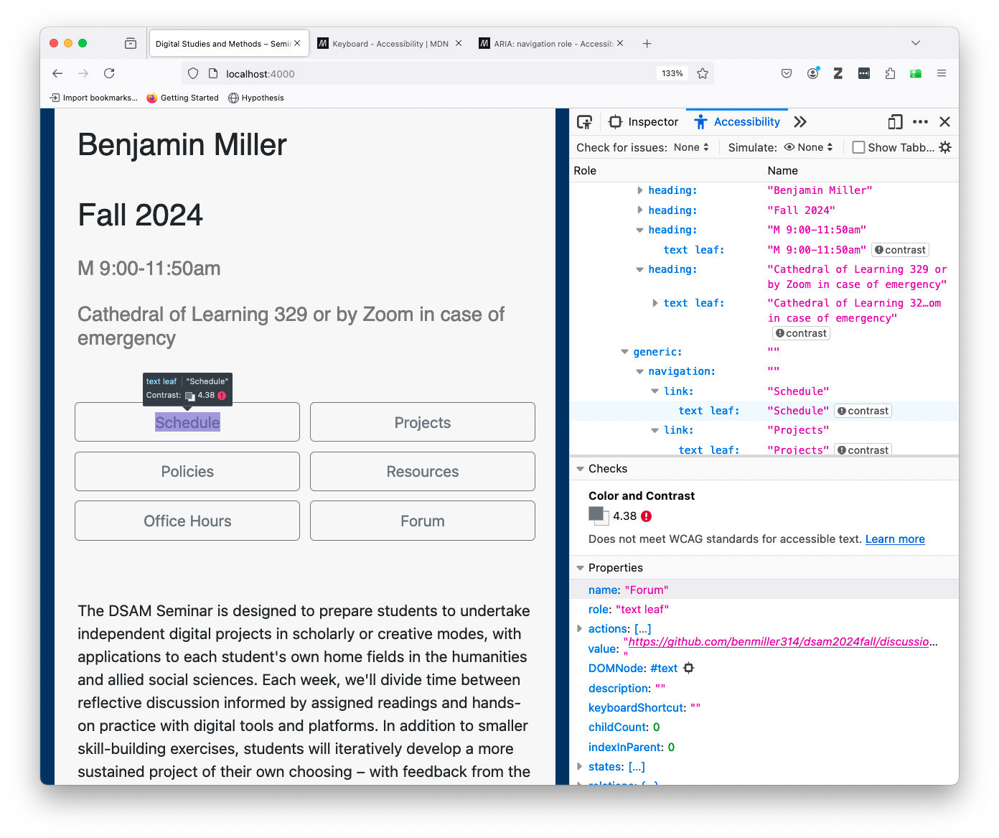

# Week 10: Access + Accountability
October 27, 2025

<section class="prereqs">
    

<strong>Texts to have read / watched</strong>

        <ul>
            <li>Eisenberg, David. “Digital Accessibility: What It Is and Why It Matters.” Perkins School for the Blind, 17 May 2021, <a href="https://www.perkins.org/digital-accessibility-makes-the-world-a-better-place/">https://www.perkins.org/digital-accessibility-makes-the-world-a-better-place/</a>.</li>
            <li>Selections from the W3C Web Accessibility Initiative (WAI):<ul>
                <li><a href="https://www.w3.org/WAI/fundamentals/accessibility-principles/">"Accessibility Principles"</a> (Overview)<ul>
                    <li><a href="https://www.w3.org/WAI/people-use-web/tools-techniques/perception/">Perception - hearing, feeling and seeing</a></li>
                    <li><a href="https://www.w3.org/WAI/people-use-web/tools-techniques/presentation/">Presentation - distinguishing and understanding</a></li>
                    <li><a href="https://www.w3.org/WAI/people-use-web/tools-techniques/input/">Input - typing, writing, and clicking</a></li>
                    <li><a href="https://www.w3.org/WAI/people-use-web/tools-techniques/navigation/">Interaction - navigating and finding</a></li>
                </ul></li>
                <li><a href="https://www.youtube.com/watch?v=3f31oufqFSM">"Web Accessibility Perspectives - Compilation of 10 Topics/Videos"</a></li>
                <li><a href="https://www.w3.org/WAI/people-use-web/tools-techniques/">How People with Disabilities Use the Web: Tools and Techniques</a></li>
            </ul></li>
            <li>WebAIM (Web Accessibility in Mind). "Alternative Text." 19 Oct. 2021, <a href="https://webaim.org/techniques/alttext/">https://webaim.org/techniques/alttext/</a>.</li>
            <li>Autistic Self Advocacy Network. “ASAN Says No Generative AI in Plain Language.” 29 July 2025, <a href="https://autisticadvocacy.org/2025/07/asan-says-no-generative-ai-in-plain-language/">https://autisticadvocacy.org/2025/07/asan-says-no-generative-ai-in-plain-language/</a>.</li>
            <li>Yergeau, M. Remi, Elizabeth Brewer, Stephanie L. Kerschbaum, Sushil Oswal, Margaret Price, Michael J. Salvo, Cynthia L. Selfe, and Franny Howes. “Multimodality in Motion: Disability and Kairotic Spaces.” <em>Kairos: A Journal of Rhetoric, Technology, and Pedagogy</em>, vol. 18, no. 1, Aug. 2013, <a href="https://kairos.technorhetoric.net/18.1/coverweb/yergeau-et-al/index.html">https://kairos.technorhetoric.net/18.1/coverweb/yergeau-et-al/index.html</a>.</li>
        </ul>
    

    

<strong>Writing to turn in</strong>

        <ul><li>two peer reviews, posted to the <a href="{{site.repo_url}}/discussions/8">discussion forum</a></li></ul>
    

</section>

## Plan for the day:

* [First half](#first-half): Let's discuss!
    - Warm-up writing: tensions, takeaways, confusions, questions
    - Discussion: Questions, comments, connections
    - Writing to remember (around 10:20)
    - Sharing (around 10:30)
* Break (10 minutes)
* [Second half](#second-half): Let's practice!
    - Writing alt text
    - Inspecting accessibility
    - Headings and document outlines
    <!-- - non-mouse navigation: keyboard, screen readers -->
    - EXT: Studio. <!-- Assess (and improve) the accessibility of your own public-facing project presentation. Except that _no one_ has a website yet, so...  -->
* [Homework for next time](#hw):
    - machines + learning
    - looking ahead

## First half: Discussion {#first-half}

### Warm-up writing: tensions, takeaways, confusions, questions
I'd like you to start by calling to mind the readings for this week. What stands out to you as a particularly important **take-away**, something memorable or surprising? What stands out as an **unresolved** point of tension or confusion?

Depending on your own practices, you may want to make lists or freewrite, or even draw a picture or diagram. Either way, I want to spend 5 minutes on this composing-to-center. I won't collect it, but I will ask for volunteers to share.

### Discussion: Questions, comments, connections

Let's discuss! We can take notes at [bit.ly/dsam{{site.course.slugterm}}-notes](https://bit.ly/dsam{{site.course.slugterm}}-notes).

If we get to grok-writing by around 10:15, that should give us about equal time to play with the concepts now and to play with the methods in the second half.

**Who would like to share?**

    
Starting points, should we need them

    <ol class="spaced">
        <li>How do Yergeau, Brewer, Kerschbaum, Oswal, Salvo, Selfe, and Howes take advantage of the digital medium in "Multimodality in Motion: Disability and Kairotic Spaces" to do things that wouldn't be possible on paper or in person? In what ways do they follow their own advice to make their webtext accessible and hospitable? </li>
        <li><em>Perceivable, operable, understandable, robust</em>. How are these terms defined in relation to accessibility? How do they relate to digital studies concepts from earlier in the semester, including the <a href="week-01#digital">affordances of digital media</a> that we discussed way back in lesson 1, that things made of digital bits are characterized by: <em>numerical representation, modularity, automation, variability, and transcoding</em> – or, alternately, that they are by virtue of their digital nature capable of sustaining <em>procedural, participatory, encyclopedic, and spatial</em> characteristics? What do you notice differently about those earlier framings in light of the WAI terms?</li>
        <!-- <li>What does it mean to say that "Universal design is a process, a means rather than an end" (Yergeau et al, access.html)?</li> -->
        <li>
We'll talk more about generative AI in week 11, but given what you already know about GenAI, would you want to automate the creation of alt text? What could be the benefits? What could go wrong?

How about video transcripts: is the risk/reward calculation the same?
</li>
        <li>
Yergeau et al <a href="https://kairos.technorhetoric.net/18.1/coverweb/yergeau-et-al/pages/access.html">write</a>,

            <blockquote>
                
Universal design is a process, a means rather than an end. There’s no such thing as a universally designed text. There’s no such thing as a text that meets everyone’s needs. That our webtext falls short is inevitable.

                
But to say that no text will be universally accessible is not a justification for failing to consider what audiences are invited into and imagined as part of a text. It matters who reads, in matters who engages, and it matters who is conceptualized as a reader.

            </blockquote>
            
Consider the "public-facing deliverable" you've been iteratively developing for your own project. Who is "conceptualized as a reader" by your design choices so far? In what ways do you / will you invite access to your project?

        </li>
    </ol>

EXT: The fairness conundrum of presentations 3 & 4.

### Grok writing

    Spend some time putting marks on a page to help you think through, and consolidate for yourself, what we discussed today. What do you want to remember? What are you left wondering?

After a few minutes, I'll ask everyone to share one thing, to which the only response will be "thank you."

## Break (10 minutes)
I'm guessing we'll hit the break at around 10:40 or so. Try to be back for a 10:50 start, so we have a full hour to get hands-on.

## Second half: Let's practice! {#second-half}

I have way more we could do than we'll actually have time for. Let's start at the top, and move self-paced through the rest – but I'll periodically cut in to make sure you get at least a little time with each of the following:

1. writing alt text
2. using headings to make document outlines
3. testing accessibility with plug-in and built-in tools

Any extra time you have is for studio; just save me a few minutes at the end.

### Writing alt text
As we've seen, the context of an image is essential to deciding what would be appropriate as a textual alternative: it depends what you're trying to communicate. Rather than ask you to work within an artificial context, then, I'm going to choose one you all have already: _your own project presentations from last week._

Of the images you included, which do you think you'll want to show again – whether as part of your public-facing project or as part of a process reflection for this class?

    If you haven't yet done so, take some time now to write text alternatives for at least a few of the images you plan to use.

* If you're working within a presentation, you can probably right-click on the image in your presentation software to enter alt text
* If you're working on a website, including a web-based README file, you have several options:
    - The image tag can take an alt attribute: ``
    - You can add a caption, linked to the visual using `<figure><figcaption></figcaption></figure>`. (For an example, right-click one of the images below and Inspect Element to see the underlying markup.)
    - You can use body text alongside the image to parallel what the image is "saying," so you can use empty alt text (`alt=""`) without losing meaning.
* If you don't yet have screenshots of your project-in-progress, go ahead and take some now! You can write draft alt text in a text file, to save for a future presentation or process reflection. Just be sure to include the image filename, so you know what the text corresponds to.

### Headings and document outlines

**Even if you don't know much HTML, it's good to know about headings**, because they're also present in other places like Word documents, Google docs, and Markdown files (such as a GitHub README).

In general, you shouldn't choose a heading level based on what it looks like – you can always change what it looks like to suit your preferences. Instead, use a logical nested sequence:

* Use a single `<h1>` (or `#` in Markdown) at the top of the page: this is more or less your title. Each document should have one, but only one, `h1`.
* Use `<h2>` (or `##`) for the main sections of the page: the first column of the outline, essentially. Don't skip straight to `<h3>` or below.
* You can, however, jump back *up* to an `<h2>` if you've gotten down past `<h3>` to `<h4>`
* In general, differences in heading levels past the fourth are too hard to discern or keep track of, and you should probably look to restructure or just use a list or boldface (or both) to structure whatever's going on at that level of detail.

Let's have a look at our notes document: are the headings properly structured? Are there any days when additional structure would be beneficial?

How about the README for your project (if you have one)?

### Inspecting a website's accessibility

There are multiple ways.

<ol>
    <li>We might try the <a href="https://wave.webaim.org/">WAVE browser extension/plugin</a>.
        <figure>
            
            <figcaption>The WAVE extension will quickly summarize both inhospitable features (errors, alerts) and hospitable features (features, structural elements) of the current web page, and labels them with icons. Further tabs provide details and reference materials you can use to improve.</figcaption>
        </figure>
    </li>

    <li>Firefox has a pretty great built-in Accessibility Inspector. Just right-click anywhere on the page and choose "Inspect Accessibility Properties."
        <figure>
            
            <figcaption>Available by default in Firefox, the Accessibility tab of the Inspector tool can check for contrast, keyboard navigation, and text labeling issues. It can also simulate various kinds of color-blindness.</figcaption>
        </figure>
        <ul>
            <li>NB: Look for the "check for issues" button at the start of the inspector tab; you may have to change it from "None."
                <figure>
                    
                    <figcaption>Issues to check for include color contrast, keyboard navigation, and the availability of text labels for navigable or interactive components of the page.</figcaption>
                </figure>
            </li>
        </ul>
    </li>
    <li>Did you know that PowerPoint will also let you check color contrast and reading order for keyboard users? On the Review tab, select the option to "Check Accessibility." This tip courtesy of PR company Current Global's <a href="https://accessible-communications.com/take-the-21-day-challenge/">"Accessible By Design" 21-Day Challenge</a>.</li>
</ol>

Choose one of the above and check your own project pages, my course pages, or any other web interface you're interested in improving.

<!--
NB: Any browser inspector will also let you experiment with changes to fonts, colors, and layouts – just remember to save your changes outside of the browser, or you'll lose them if you refresh the page.

(The color picker in Chrome's inspector is particularly good. Chrome's accessibility checker, less so, though their "accessibility tree" – the tab order, sort of - has improved over time.) -->

### EXT: Studio

Finished with all the above? **Use the remaining time to move your project forward** – or to produce transcripts of your video/audio files from last week. (Check the [resources page](../resources#transcription-services) for my current favorite AI transcription tool – or suggest others!)

Save 10 minutes at the end: five for a quick exit note in the google doc and another five to look ahead at the next few weeks.

## Homework for next time {#hw}

As always, continue working on your project – now with a little more feedback – and take notes in your [Mindful Practice Journal](projects.md).

Next week we'll talk about machine learning and GenAI, and the week after that I'm asking you all to bring in example projects in your fields that are awesome and inspiring. So if you haven't yet looked around at what your digital project is in conversation with, consider this a two-week warning! ;) (But no, your example doesn't have to be on the exact same subject.) Alison will be joining us for both of those, and for the second she'll be hosting in person while I Zoom in from New York.

For next week, I'll also ask you to **[add your thoughts to the discussion forum]({{site.repo_url}}/discussions) after reading**. For our lead responders, I believe we're back to John, Rose, Tunga, Scylla, and Yuqing.

In preparation for <a title="required reading: 92 page-equivalents; EXT reading adds 48 not counting the new stuff on Sora 2">week 11</a>, please **watch / read**:

* "Computer Scientist Explains Machine Learning in 5 Levels of Difficulty." WIRED, YouTube, 18 Aug 2021. <a href="https://www.youtube.com/watch?v=5q87K1WaoFI">https://www.youtube.com/watch?v=5q87K1WaoFI</a>.
* Newhauser, Mary. “What Is Generative AI? A Comprehensive Guide for Everyone.” GPTech, 26 June 2023, <a href="https://www.gptechblog.com/what-is-generative-ai-comprehensive-guide-beginners">https://www.gptechblog.com/what-is-generative-ai-comprehensive-guide-beginners</a>.
* Bycroft, Brendan. LLM Visualization. <a href="https://bbycroft.net/llm">https://bbycroft.net/llm</a>. Accessed 29 July 2025.
* Roberts, Sarah T. “Your AI Is a Human.” <em>Your Computer Is On Fire</em>, edited by Thomas S. Mullaney, Benjamin Peters, Mar Hicks, and Kavita Philip, MIT Press, 2021, pp. 61–83. ProQuest Ebook Central, <a href="http://ebookcentral.proquest.com/lib/pitt-ebooks/detail.action?docID=6479710">http://ebookcentral.proquest.com/lib/pitt-ebooks/detail.action?docID=6479710</a>.
* Pengfei Li, Jianyi Yang, Mohammad A Islam, and Shaolei Ren. “Making AI Less ‘Thirsty’.” <em>Communications of the ACM</em>, vol. 68, no. 7, June 2025, pp. 54–61, <a href="https://doi.org/10.1145/3724499">https://doi.org/10.1145/3724499</a>.
* Shane, Janelle. “An Exercise in Frustration.” AI Weirdness, 21 May 2024, <a href="https://www.aiweirdness.com/an-exercise-in-frustration/">https://www.aiweirdness.com/an-exercise-in-frustration/</a>.
* Shane, Janelle. “When Algorithms Surprise Us.” AI Weirdness, 13 Apr 2018, <a href="https://www.aiweirdness.com/when-algorithms-surprise-us-18-04-13/">https://www.aiweirdness.com/when-algorithms-surprise-us-18-04-13/</a>.
* Onuoha, Mimi and Mother Cyborg (Diana Nucera). “A People’s Guide To Tech: Artificial Intelligence.” Allied Media Projects, Aug 2018, <a href="https://alliedmedia.org/resources/peoples-guide-to-ai">https://alliedmedia.org/resources/peoples-guide-to-ai</a>.

* EXT for eager readers:
    - **NEW** since the semester started:
        * OpenAI. Sora 2 Is Here. 30 Sept. 2025, [https://openai.com/index/sora-2/](https://openai.com/index/sora-2/).
        * Thompson, Tiffany, Stuart A. Hsu, and Steven Lee Myers. “OpenAI’s Sora Makes Disinformation Extremely Easy and Extremely Real.” <em>The New York Times</em>, 3 Oct. 2025. NYTimes.com, [https://www.nytimes.com/2025/10/03/technology/sora-openai-video-disinformation.html](https://www.nytimes.com/2025/10/03/technology/sora-openai-video-disinformation.html).
        * Witt, Stephen. “Opinion: The A.I. Prompt That Could End the World.” <em>The New York Times</em>, 10 Oct. 2025. NYTimes.com, [https://www.nytimes.com/2025/10/10/opinion/ai-destruction-technology-future.html](https://www.nytimes.com/2025/10/10/opinion/ai-destruction-technology-future.html).
    - Vara, Vauhini. “Ghosts.” <em>Believer Magazine</em>, 9 Aug. 2021, <a href="https://www.thebeliever.net/ghosts/">https://www.thebeliever.net/ghosts/</a>.
    - Crawford, Kate, and Trevor Paglen. “Excavating AI: The Politics of Training Sets for Machine Learning.” 19 Sep 2019, <a href="https://excavating.ai">https://excavating.ai</a>.
    - Alamar, Jay. "ChatGPT Has Never Seen a SINGLE Word (Despite Reading Most of The Internet). Meet LLM Tokenizers." YouTube, 26 Jul 2023. <a href="https://www.youtube.com/watch?v=uSinkCeUg9U">https://www.youtube.com/watch?v=uSinkCeUg9U</a>.
