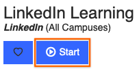

*This set of resources will likely expand as we move forward; feel free to suggest others that you come across!* (You can fork the repo, <a href="{{site.github.repository_url}}/blob/gh-pages/{{page.path}}">edit this page</a>, and file a pull request! Or just email me. That works, too.)

# Resources

Table of contents:

* [Services at Pitt](#services-at-pitt)
* [Help with Git and GitHub](#help-with-git-and-github)
    - [Dealing with Large Files (including how to shrink images)](#dealing-with-large-files)
* [Text Editors](#text-editors)
* [Transcription services](#transcription-services)
* [Extraction services](#extraction-services)
* [Digital Literacies Tutorials](#digital-literacies-tutorials)
* [Options for publishing to the web](#options-for-publishing-to-the-web)
    - [How to hide your website from search engines](#how-to-hide-your-website-from-search-engines)
* [Academic Journals](#academic-journals)
* [Other Resource Roundups](#other-resource-roundups)

<!-- /TOC -->

## Services at Pitt
<dl>
<dt><a href="http://www.studentaffairs.pitt.edu/drs/">Disability Resources</a></dt>
<dd>If you have a disability for which you are or may be requesting an accommodation, you are encouraged to contact both your instructor and the Office of Disability Resources and Services, 140 William Pitt Union, 412-648-7890 / 412-624-3346 (Fax), as early as possible in the term. Disability Resources and Services will verify your disability and determine reasonable accommodations for this course.</dd>

<dt><a href="https://library.pitt.edu/digital-scholarship-services">Digital Scholarship Services at Pitt Libraries</a></dt>
<dd>As their website says, DSS is "a front-end to the library's resources, expertise, and services in support of a broad range of digital and data-intensive scholarly activities. From designing a digital humanities project to making a data management plan for a grant application, [they]’re here to help." You can make an appointment for a consult on coding and computation; research data services; digital creation and stewardship; geospatial or textual data and analysis; and more. See especially their subscribe-able calendar of free <a href="https://pitt.libcal.com/calendar/today/?cid=2274&t=d&d=0000-00-00&cal=2274&ct=26796,28278&inc=0">workshops</a> and/or <a href="https://confirmsubscription.com/h/t/DF8BAC3FE84F3E2D">sign up for their newsletter</a> to get email updates and reminders.</dd>

<dt><a href="https://my.pitt.edu/task/all/cssd-linkedinlearning">LinkedIn Learning tutorials</a></dt>
<dd>

This is a portal for high-quality, often in-depth, video and screencast tutorials for a wide variety of digital tools: from audio, image, and video editing, to web design, to photography and graphic design, to programming languages. Your tuition dollars give you access while you're at Pitt; might as well take advantage while you can!
 <figure class="float-right"></figure>

You'll need to <strong>log in first through my.pitt.edu</strong>; click the Start button to access the video library, and then search within that. Otherwise, it'll try to get you to sign up or log in through LinkedIn, which is probably not what you meant to do.

</dd>

<dt><a href="http://www.studentaffairs.pitt.edu/cc/">Counseling Services</a></dt>
<dd>Pitt also offers free counseling for students who are experiencing personal or emotional difficulties. The Counseling Center, located on the 2nd Floor Nordenberg Hall, offers Psychological Services and Sexual Assault Services (412-648-7930) (8:30 am-5:00 pm, Monday-Friday) or (412-648-7856) (after 5 pm, Monday-Friday or on weekends).</dd>

<dt><a href="https://upstreetpgh.org/">UpStreet mental health services</a></dt>
<dd>Not actually a Pitt service, but a Pittsburgh one, and still potentially good to know about: UpStreet offers free, no-appointment-needed counseling with licensed mental health professionals via webchat -- and it's designed for people aged 12-22. They also have free readings on coping with stress and other wellness topics; conversely, they also offer paid appointments for more extensive one-on-one therapy. </dd>

<dt><a href="http://writingcenter.pitt.edu/">Pitt Writing Center</a></dt>
<dd>Though not every consultant will have experience in multimodal composing or digital media, some will; but more importantly, the Writing Center's emphases on process-oriented reflection and rhetorical thinking makes every consultant a useful sounding board for developing ideas, getting feedback from an outside reader, and getting organized for revision and reflection. It's a good idea to <a href="http://writingcenter.pitt.edu/undergraduate-services">plan for your visit</a> and to make an appointment before you go.</dd>

</dl>

<a href="#top"><em>Back to top</em></a>

## Help with Git and GitHub
<dl>
<dt><a href="https://education.github.com/discount_requests/new">Get free private repositories</a></dt>
<dd>Important for starting out: GitHub defaults to making repositories public, and ordinarily you would have to buy a paid account to keep your projects private. But if you have a .edu email account, you can request a discount that lets you get unlimited private repositories for free. Click the link to find out more.</dd>

<dt><a href="https://docs.github.com/en/desktop/getting-started-with-github-desktop">Getting Started with GitHub Desktop</a></dt>
<dt><a href="https://docs.github.com/en/desktop/contributing-and-collaborating-using-github-desktop">Contributing and Collaborating using GitHub Desktop</a></dt>
<dd>The official documentation for using the GH Desktop application, a GUI (graphical user interface) that gives you more flexibility than the GitHub website, but also a more user-friendly appearance (including next-step-in-the-workflow suggestions) than command-line git. See especially the section, part of the second page linked above, about <a href="https://docs.github.com/en/desktop/contributing-and-collaborating-using-github-desktop/making-changes-in-a-branch">making changes in a branch</a>.</dd>

<dt><a href="http://ohshitgit.com/">ohshitgit.com</a></dt>
<dt><a href="https://dangitgit.com/">dangitgit.com</a></dt>
<dd>These are the same site; the second is just, ah, cleaned up a bit. The frustration, though, is the same, because let's face it: there are times when even experienced users of git feel that something has gone terribly wrong. This is a great resource of quick command-line fixes for common problems – including some that can't be fixed by GH Desktop alone – compiled by someone who feels your pain.</dd>

<dt><a href="https://www.youtube.com/watch?v=BCQHnlnPusY&list=PLRqwX-V7Uu6ZF9C0YMKuns9sLDzK6zoiV">Git and GitHub for Poets</a></dt>
<dd>A delightfully nerdy, yet strangely accessible, playlist of tutorial videos on using GitHub and Git (in that order) to keep track of changes to a text file. A great way to learn more about the features that make these tools appealing to coders and non-coders alike. Made by one of the evangelists of the Processing programming language for dynamic drawings.</dd>

<dt><a href="https://education.github.com/git-cheat-sheet-education.pdf">Git Cheat Sheet</a></dt>
<dd>Two pages containing everything you need to know for everyday version-tracking, from how to set up your local repository to how to recover past versions, with your normal status->add->commit->push-> workflow prominently placed. This is all for the command line; if that makes you uncomfortable, you might enjoy this somewhat irreverent <a href="https://learning.oreilly.com/library/view/learn-python-the/9780133124316/app03.html">Command Line Crash Course</a>. Or, you know, just go with the GitHub Desktop GUI.</dd>

<dt><a href="https://lab.github.com/paths">GitHub Learning Lab</a></dt>
<dd>Should you feel enticed by our course to want to go deeper into the capabilities of GH and go with the GitHub Flow, come here: it's a system of tutorials built directly into the GitHub web interface, with a "robot" that gives you prompts and affirmations of success right in the Issue Queues and Revision Histories of your own repositories. (Each new "course" you take in the Learning Lab will auto-generate a new repository to play with.) To enable this magic of automation work, you'll have to give the app some major permissions on your account – but since it's written by the same people who make GitHub, I felt pretty comfortable trusting them anyway. (They already keep all my stuff, you know?)</dd>

</dl>

<a href="#top"><em>Back to top</em></a>

### Dealing with Large Files

<dl><dt>Option 1: Git LFS</dt>
<dd>

If you get an error message telling you that you can't push to GitHub because your files are too large, you can try <a href="https://git-lfs.github.com/">Git Large File Storage</a> (git-lfs): it stores large files on a separate server, and converts the file in your GH repo into a tiny pointer file. The <a href="https://docs.github.com/en/free-pro-team@latest/github/managing-large-files/versioning-large-files">documentation</a> is pretty clear, though it does involve a little command-line fu at times. (Nothing major: you can just follow the steps.) And when it's all set up, it works in GitHub Desktop pretty seamlessly.

The one catch is that if you're using git-lfs on a forked repo, the extra storage you get counts against the quota of the <em>upstream</em> fork, so if everyone uses it for class assignments, eventually I run out of data and *nothing* can be pushed. So if that's where you need the LFS, at the end of the semester, I'll ask you to re-clone your repo and add a new remote branch that's not on my fork tree. But we'll cross that bridge if/when we come to it!

Oh! And if you discover that you have large files you can't push after they're already in your commit history, you'll need to start managing *those* large files with git-lfs, too. Luckily there's now <a href="https://github.blog/2017-06-27-git-lfs-2-2-0-released/">a (simple command line) tool to help you do that</a>!

If all else fails, fear not! You can always (1) start an empty new repository on GitHub, (2) point your local repository to that new one by <a href="https://docs.github.com/en/github/using-git/changing-a-remotes-url">changing the remote URL at the command line</a>, and (3) push your now-correctly-configured files to the new repository. The new repo should now inherit the entire history of your local one, including all your messages. Just be sure to (4) add a link to the new repository in the README.md file of your old one, so we can find it easily.

</dd>

<dt>Option 2: File Compression</dt>
<dd>
    
Alternately, depending on what you're pushing (or if even LFS is complaining), you can try <em>compressing</em> the files. But while most computers come with built-in compression algorithms, they tend not to be very good. Luckily, there are several excellent and free applications that will happily shrink your file sizes. Here are some recent roundups:

    <ul>
        <li>For any file/folder on <strong>Windows:</strong> <a href="http://www.makeuseof.com/tag/the-top-3-file-compression-extraction-softwares/">www.makeuseof.com/tag/the-top-3-file-compression-extraction-softwares/</a></li>
        <li>For any file/folder on <strong>Mac:</strong> <a href="https://mac.eltima.com/best-archiver-mac.html">mac.eltima.com/best-archiver-mac.html</a></li>
        <li>To shrink the dimensions or resolution of static images like .jpg and .png, search for "local image reducer" and the year. For me, in 2024, I found this <a href="https://icecreamapps.com/learn/best-image-resizers.html">list of image-resizing software</a> that unsurprisingly includes its own Icecream software for Windows – but also a reminder that MacOS has this capability built in for free, in Preview.
            <ul><li>For more on .png vs .jpg file formats, see this <a href="https://www.techsmith.com/blog/jpg-vs-png/">overview</a> or this more <a href="https://www.digitaltrends.com/photography/jpeg-vs-png/">technical explanation</a>.</li></ul>
        </li>
    </ul>
</dd>
</dl>

<a href="#top"><em>Back to top</em></a>

## Text Editors

There are lots of great coding-friendly text editors out there, and even many excellent free ones. Essential features to look for are <em><a href="https://en.wikipedia.org/wiki/Syntax_highlighting#:~:text=Syntax%20highlighting%20is%20a%20feature,to%20the%20category%20of%20terms">syntax highlighting</a></em>; <em>soft wrapping</em> of text, so lines don't run off to the side forever (look for this in preferences); and the ability to <em>view several files side-by-side</em>, sometimes activated by right-clicking on the filename and asking to "split right" (or left, up, down, you get the idea).

<dl>
<dt><a href="https://pulsar-dev.io">Pulsar text editor</a></dt>
<dd>

The direct inheritor of Atom, the text editor developed by the GitHub community. It's got a lot going for it: it's cross-platform (Mac/Windows/Linux). It uses your existing file system for project management, rather than inventing its own file system like some IDEs. It has flexible panes for viewing and customizable color themes. And it's open source and extendable – and thus has lots of packages out in the world, including to preview rendered HTML or Markdown. Plus, because it works directly with git and GitHub, you can see what files have changed without even having to leave the editor.

When Atom was discontinued by Microsoft in 2022 in favor of their own Visual Studio Code (see below), someone forked the repository and kept it alive – now under the new name of Pulsar. Pretty much anything you see recommended for Atom should work smoothly in Pulsar, though of course nothing stays the same forever, and I make no outright promises.

I'm still in the market for good tutorials, but <a href="https://www.youtube.com/playlist?list=PLLnpHn493BHHf0w8uGu9NM8LPf498ZvL_">this Atom tutorial from Level Up</a> looks pretty decent; essential episodes include <a href="https://www.youtube.com/watch?v=ZnzLPIhMJnw&list=PLLnpHn493BHHf0w8uGu9NM8LPf498ZvL_&index=4">#3 The Atom Interface with Tips and Tricks</a> and <a href="https://www.youtube.com/watch?v=IgSW1umKrVs&list=PLLnpHn493BHHf0w8uGu9NM8LPf498ZvL_&index=7">#6 Project Management In Atom</a>. I also highly recommend turning on Soft Wrap, which you can find under the "Editor" pane of Pulsar > Preferences.

</dd>

<dt><a href="">Visual Studio Code</a></dt>
<dd>
    
This is a widely popular syntax-aware text editor, and ships with the "IntelliSense" predictive text feature already active for several popular programming languages (and extensible for others). It's particularly valuable when you power it up with <em>extensions</em> written by the open source community to add new functionality. In general, if there's anything you think VS Code <em>should</em> be able to do, chances are someone's already made it happen. To search for, install, or otherwise manage extensions from within VS Code, go to View > Extensions or click on the sidebar icon that looks like building blocks. I personally prefer Atom/Pulsar for everyday use, but VS Code has a few legs up in some places, including its built-in terminal window.

    
Some extensions I expect you'll find useful:

    <ul>
        <li>
            
<a href="https://marketplace.visualstudio.com/items?itemName=george-alisson.html-preview-vscode">HTML Preview</a>, by George Oliveira (note that the more-frequently downloaded one, by Thomas Haakon Townsend, is no longer being maintained). Lets you see a preview of your HTML file without having to head to the browser (though you may still want to, for inspector reasons!)

        </li>
        <li>
            
<a href="https://marketplace.visualstudio.com/items?itemName=Compulim.compulim-vscode-closetag">Close HTML/XML tag</a>, by Compulim: adds a keyboard shortcut to automatically detect the last-opened html tag, and close it. Useful for proofreading! (NB: this feature is already installed by default on Pulsar; see Packages > Bracket Matcher for the shortcut.)

        </li>
        <li>
            
<a href="https://marketplace.visualstudio.com/items?itemName=formulahendry.auto-rename-tag">Auto Rename Tag</a>, by Jun Han. If you change an <code class="language-plaintext highlighter-rouge">h2</code> to an <code class="language-plaintext highlighter-rouge">h3</code>, this will automatically update the corresponding closing or opening tag so you don’t end up with a mismatch.

        </li>
        <li>
            
<a href="https://marketplace.visualstudio.com/items?itemName=formulahendry.auto-close-tag">Auto-Close Tag</a>, by Jun Han. Every time you open a new HTML tag, the corresponding closing tag will be generated automatically. A lot of people love this, but to tell the truth, I find it annoying; your mileage may vary.

        </li>
    </ul>

    
Read the README inside any installed package for tips on how to use it. This will open just like any other file, so you can move it, split it, etc.

</dd>
</dl>

<a href="#top"><em>Back to top</em></a>

## Transcription services

If you're recording video, whether for your projects or for in-class presentations, it's a good idea to produce a text-only version as well. Not only will this help non-sighted people access your work, but it will also help enable search and improve <abbr title="search engine optimization" aria-label="Search Engine Optimization">SEO</abbr>.

If you're working from a script, great! There's your transcript. Taking this approach will also help you take advantage of your existing skills in revising text en route to producing your video draft, so you can spend less time editing in video software.

But if you're more of an extemporaneous speaker, not to worry; there are now also affordable (and even free) tools to extract text from video and audio files after the fact.

<dl>
<dt><a href="https://www.rev.com/">Rev (https://www.rev.com)</a></dt>
<dd>My current favorite transcription service as of 2024. In its free tier, Rev allows up to 45 minutes of transcripts and captions per month and doesn't lock your files into their system: you can download in various <a href="https://kairos.technorhetoric.net/20.2/inventio/stolley/">"LO-FI"</a> formats compatible with many other platforms. After uploading a video or audio file, an AI language detection system will generate a transcript in minutes; an integrated playback and editing system makes it easy to proofread.</dd>
</dl>

Have a service or strategy you prefer? Please tell me about it, so I can add it here!

<a href="#top"><em>Back to top</em></a>

## Extraction Services

In some ways the opposite of transcription, these are tools that will help you recover text or data from sources that were encoded as images. There are a great many more of them out there than I can list (and more all the time), but here are a few that come with recent recommendations.

<dl>
<dt><a href="https://tabula.technology/">Tabula</a></dt>
    <dd>As they put it on their site, "If you’ve ever tried to do anything with data provided to you in PDFs, you know how painful it is — there's no easy way to copy-and-paste rows of data out of PDF files. Tabula allows you to extract that data into a CSV or Microsoft Excel spreadsheet using a simple, easy-to-use interface. Tabula works on Mac, Windows and Linux. [...] Tabula was created by journalists for journalists and anyone else working with data locked away in PDFs. Tabula will always be free and open source." Recommended by Cody Hmelar in 2024.</dd>
<dt><a href="https://library.pitt.edu/text-mining-and-analysis">Pitt Library Digital Scholarship Services</a></dt>
    <dd>DSS offers help with many things DSAM-related, but one of them is a dedicated <abbr title="Optical Character Recognition" aria-label="Optical Character Recognition">OCR</abbr> workstation in Hillman Library preloaded with ABBYY FineReader. You can walk up to the station, or reserve ahead of time to make sure it'll be available.</dd>
<dt><a href="https://www.handwritingocr.com/">HandwritingOCR</a></dt>
    <dd>This is a <em>paid</em> service that uses a privacy-law-compliant AI trained on public domain and licensed datasets to convert images of writing – especially but not exclusively handwritten – to structured digital text. Recommended by Reddit user <a href="https://www.reddit.com/user/mcw1980/">mcw1980</a> after a fairly extensive <a href="https://www.reddit.com/r/computervision/comments/1ctf0jh/2024_review_of_ocr_tools_extracting_text_from/?rdt=38422">test of competing services</a> as of May 2024. Should work across a number of language groups, though I don't know how many mcw1980 tested. The pay-as-you-go cost in November 2024 was $12 for 100 pages.</dd>
</dl>

<a href="#top"><em>Back to top</em></a>

## Digital Literacies Tutorials

In this section, I want to add tutorials for acquiring digital competencies that will apply broadly, beyond specific tools or use-cases.

<dl>
<dt>Regular Expressions</dt>
<dd>
The first example I want to add is for the souped-up search-and-replace tool, <em>regular expressions</em> (or <em>regex</em> for short). Do you need to find all the words in a document that start with capital letters but don't start sentences? Need to find names listed Lastname, Firstname and dynamically reshape them so they're Firstname Lastname – in a single step? Need to add a new XML tag or CSS class to every datelike string in a document? Regex lets you do all this, and more. I've found it as useful for parsing unstructured documents into data-like formats as for updating lesson plans and application materials from one year to the next.

And I've just discovered an interactive tutorial that makes it pretty quick to learn: check out <a href="https://regexlearn.com/">https://regexlearn.com/</a>. You might just <a href="https://xkcd.com/208/" title="xkcd is by Randall Munroe, and is licensed under CC-BY-NC-2.5.">feel like a superhero</a>.

</dd>
<dd>More suggestions welcome as you find them!</dd>
</dl>

## Options for publishing to the web

There are a great many free options for publishing online these days, including WordPress in both <a href="https://wordpress.com">managed</a> (easier for beginners) and <a href="https://wordpress.org">self-hosted</a> (more customizable, but you have to have a server) formats; <a href="https://wix.com">Wix</a>; and <a href="https://medium.com">Medium</a>.

If you're working with a GitHub repository, you can also create a website directly from your files with <a href="https://pages.github.com">GitHub Pages</a>: in fact, that's how I'm hosting this website!

For a low-barrier entree into GitHub Pages, I recommend [Open Fuego](https://open-fuego.github.io/Open-Fuego-Coding-Tools/): a templating structure designed from the outset to make it easier to work with HTML, and developed right here at Pitt by Dr. Stephen Quigley (English).

Check out the 3-minute OpenFuego tutorial to learn more.

<iframe width="560" height="315" src="https://www.youtube.com/embed/QzMJtLUncIg" title="Open Fuego Webtext Generator (3-min tutorial) via YouTube" frameborder="0" allow="accelerometer; autoplay; clipboard-write; encrypted-media; gyroscope; picture-in-picture; web-share" allowfullscreen></iframe>

### How to hide your website from search engines

You can make a website accessible to the world by using GitHub Pages, which is great for sharing personal or professional sites with friends, family, and potential employers. But while you're developing through several iterations, you may not be ready to spread the link around too too broadly.

In that case, you'll want to create a file called <strong>robots.txt</strong> to tell all the webcrawlers (from Google and Yahoo, not from Marvel) to leave your site out of their indexes. See <a href="https://moz.com/learn/seo/robotstxt#:~:text=Blocking%20all%20web%20crawlers%20from%20all%20content">moz.com/learn/seo/robotstxt</a> for more information.

<a href="#top"><em>Back to top</em></a>

## Academic Journals

Digital studies and methods are deployed across the humanities and social sciences (and in STEM fields, though not usually by that name), but "digital humanities" can also be considered a disciplinary space in its own right. To follow that conversation, consider browsing the issues of one of these journals (an incomplete list):

* [Digital Humanities Quarterly](http://www.digitalhumanities.org/dhq/)
* [Digital Scholarship in the Humanities](https://academic.oup.com/dsh)
* [International Journal of Digital Humanities](https://www.springer.com/journal/42803)
* [Journal of Cultural Analytics](https://culturalanalytics.org/)
* [Journal of Writing Analytics](https://wac.colostate.edu/jwa/)

For more publication venues, see the roundups at [Pratt Institute Libraries](https://libguides.pratt.edu/digitalhumanities/journals) and the [Alliance of Digital Humanities Organizations](https://adho.org/publications/).

<a href="#top"><em>Back to top</em></a>

## Other Resource Roundups

Especially in the realm of digital production, there's no need to reinvent the wheel; just as there are many excellent tutorials and sites on which to locate assets, there are many excellent <em>lists</em> of such tutorials and sites. Here are a few to draw on:

<dl>
<dt><a href="https://programminghistorian.org/">The Programming Historian</a></dt>
<dd>In their own words, "We publish novice-friendly, peer-reviewed tutorials that help humanists learn a wide range of digital tools, techniques, and workflows to facilitate research and teaching. We are committed to fostering a diverse and inclusive community of editors, writers, and readers." There were 102 lessons posted as of mid-August 2023, grouped under five large classes of action you might take with regard to digital materials: acquire, transform, analyze, present, and sustain. Despite the "programming" in the title, many of these tutorials do not require you to write your own code – though a fair number of them do, if that's what does the job best. Well worth skimming for ideas, and especially helpful when you find a match.</dd>

<dt><a href="https://constellate.org/tutorials/">Constellate Tutorials</a></dt>
<dd>
Constellate is the latest version of JSTOR's "Data for Research" program. It allows you to query their considerable archive and download some combination of full text; ngrams of term or phrase frequencies (where n = 1, 2, or 3); and metadata about the texts, such as authors and dates of publication. Beyond that textual and metatextual data, though, they also (crucially) offer Jupyter notebooks designed to walk you through the task of conducting a computational analysis of that data, using Python.

On this tutorials page, you'll find a full range of such notebooks, ranging from the beginner level (e.g. <a href="https://constellate.org/lab?repo=https%3A%2F%2Fgithub.com%2Fithaka%2Fconstellate-notebooks&filepath=creating-stopwords-list.ipynb">creating a stopwords list</a> or <a href="https://constellate.org/lab?repo=https%3A%2F%2Fgithub.com%2Fithaka%2Fconstellate-notebooks&filepath=exploring-metadata.ipynb">refining your research dataset</a>) through intermediate (e.g. <a href="https://constellate.org/lab?repo=https%3A%2F%2Fgithub.com%2Fithaka%2Fconstellate-notebooks&filepath=finding-significant-terms.ipynb">identifying keywords by significance within a corpus</a>) to advanced (e.g. <a href="https://constellate.org/lab?repo=https%3A%2F%2Fgithub.com%2Fithaka%2Fconstellate-notebooks&filepath=sentiment-analysis-with-vader.ipynb">sentiment analysis</a> or <a href="https://constellate.org/lab?repo=https%3A%2F%2Fgithub.com%2Fithaka%2Fconstellate-notebooks&filepath=NER-1.ipynb">named entity recognition</a>.) Because they assume you'll be working with Constellate data, these tutorials will be especially useful if you actually are working with Constellate data, but they could be worth practicing with even if you're not: just pick one of their pre-made sample datasets so you can tell when the weirdness is from your code, rather than from an inherent weirdness in your corpus.

</dd>

<dt><a href="https://python-textbook.pythonhumanities.com/intro.html">Introduction to Python for Humanists</a></dt>
<dd>
I think Montfort does a great job, for the most part, of explaining why programming should appeal to humanistic researchers and creative writers or artists, and as such I'm hoping it'll work well for DSAM-ers across the board. But his exercises may not be as <em>directly</em> applicable to your independent projects as you might prefer. In that case, consider this alternate textbook – a public version of an under-contract manuscript by W.J.B. Mattingly, a postdoc at the Smithsonian and the U.S. Holocaust Memorial Museum. Mattingly's chapter on "<a href="https://python-textbook.pythonhumanities.com/01_intro/01_05-01_intro.html">Working with External Data</a>" is a quick hit for how to get data into Python from other files, and the chapters on "<a href="https://python-textbook.pythonhumanities.com/02_pandas/02_01_01_intro.html">Data Analysis with Pandas</a>" (most relevant for so-called <em>rectangular data</em>, i.e. data that might fit into a spreadsheet) or "<a href="https://python-textbook.pythonhumanities.com/03_spacy/03_01_01_intro.html">Natural Language Processing with spaCy</a>," as well as chapters on <a href="https://python-textbook.pythonhumanities.com/04_topic_modeling/04_01_01_intro.html">topic modeling</a>, <a href="https://python-textbook.pythonhumanities.com/08_booknlp/01_01_intro.html">text analysis</a> of large documents, and <a href="https://python-textbook.pythonhumanities.com/06_sna/06_01_01_intro.html">social network analysis</a>, should be quite useful for anyone whose project calls for a deeper dive into any of those methods.

Full citation: Mattingly, William. <em>Introduction to Python for Digital Humanities</em>, 2022. python-textbook.pythonhumanities.com.

</dd>

<dt><a href="https://praxis.technorhetoric.net/tiki-index.php">Kairos PraxisWiki</a></dt>
<dd>Again to quote their own framing paragraph, "PraxisWiki is a section of <em>Kairos: A Journal of Rhetoric, Technology, and Pedagogy</em> that publishes webtexts exploring the intersections and tangents of digital writing and pedagogy." All the texts here are peer-reviewed by the editorial board, and they address teaching-adjacent projects that include how-to guides for setting up data visualizations and wikis, practitioner reflections on digital composing tools and systems, and reusable assignments you can try yourself. </dd>

<dt><a href="https://cuny.manifoldapp.org/projects/journal-of-interactive-technology-and-pedagogy-no-blueprints">JITP Blueprints</a></dt>
<dd>A smaller archive in the same vein as the PraxisWiki, this time from the <em>Journal of Interactive Technology and Pedagogy</em>, but one I am proud to circulate. Blueprints are designed to be replicable / pilferable instances of interactive technology at work, aimed at beginners and coming from across the academic curriculum.</dd>

</dl>

As the semester goes on, we can identify our own list of favorites!

Finally, for a roundup of DH terms and definitions, check out the [Taxonomy of Digital Research Activities in the Humanities (TaDiRAH)](https://tadirah.info/pages/Browser.html). (For a version with text you can copy, go to <a href="https://vocabs.dariah.eu/tadirah/en/">https://vocabs.dariah.eu/tadirah/en/</a> and select the Hierarchy tab.)

<a href="#top"><em>Back to top</em></a>
